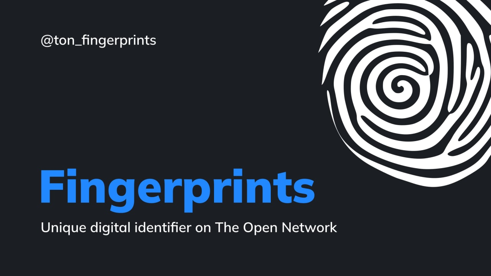

[TON Fingerprints](https://nft.mir.one/fingerprints) - A digital fingerprint is a unique digital identifier

This is a NFT collection of 10 000 unique digital fingerprints created based on the algorithm for generating basic rings using a noise texture. Like human fingerprints, you can now use them for the Web3 and Metaverse era as digital biometric information on [The Open Network](https://t.me/toncoin).

@ton_fingerprints

