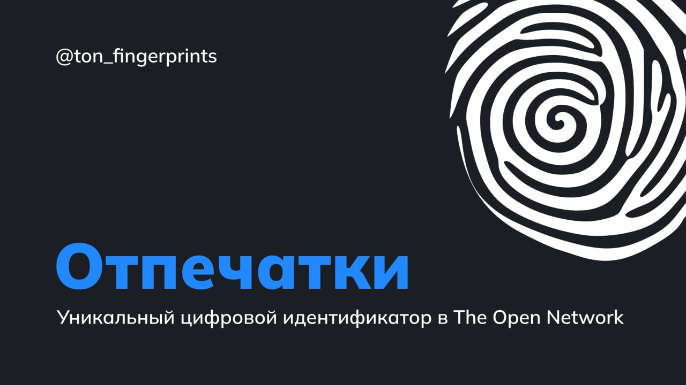

[TON Отпечатки](https://nft.mir.one/ru/fingerprints)
Цифровой отпечаток пальца — это уникальный цифровой идентификатор

Это NFT коллекция из 10 000 уникальных цифровых отпечатков пальцев, созданных на основе алгоритма генерации базовых колец с помощью текстуры шума. Как и отпечатки пальцев людей, теперь вы можете использовать их для эпохи Web3 и Metaverse, в качестве цифровой биометрической информации на [The Open Network](ttps://t.me/toncoin_rus).

@ton_fingerprints

